# Boss Monitor — Smart Office Energy Tracker

Developed by **Team Clover**:

*   **Live Web Dashboard URL:** [https://boss-monitor.vercel.app/](https://boss-monitor.vercel.app/)
*   **Production Live API Base URL:** [https://boss-monitor.onrender.com](https://boss-monitor.onrender.com)

| Name                      | University              | GitHub / Portfolio                                     |
| :------------------------ | :---------------------- | :----------------------------------------------------- |
| **Sadman Islam**          | Metropolitan University | [GitHub: amisadman](https://github.com/amisadman)      |
| **Shah Samin Yasar**      | Metropolitan University | [Portfolio](https://shahsaminyasar.vercel.app/)        |
| **Ahmed Thousif Thisham** | Metropolitan University | [Portfolio](https://ahmedthousifportfolio.vercel.app/) |

---

Boss Monitor is a real-time energy monitoring, alert, and automation system designed for modern smart offices. The project features a unified monorepo architecture:

1.  **TypeScript & Express Backend:** Serves as the single source of truth, running a 120x accelerated virtual-time simulation with active alert rules and historical snapshots stored in MongoDB.
2.  **React Frontend Dashboard:** An interactive single-page Web application built with Vite and TailwindCSS/DaisyUI that renders live status gauges, hourly bar charts, active alert alerts, and an interactive top-view office map (Furnished & Circuit mode) updated instantly via WebSockets (Socket.io).
3.  **Python Discord Bot:** A conversational AI assistant integrated with Groq LLM and the Discord API to answer questions on demand (`!status`, `!usage`, `!room`) and proactively post warning alerts to Discord text channels.
4.  **Hardware Simulation Nodes:** Simulated ESP32 microcontrollers configured in Wokwi (Drawing Room, Work Room 1, Work Room 2) running custom firmware, wiring standards, and outputting JSON payloads to Serial.

---

## 1. System Architecture

The following diagram illustrates the flow of state data, REST API requests, Socket.io real-time events, and AI conversational responses throughout the Boss Monitor ecosystem:

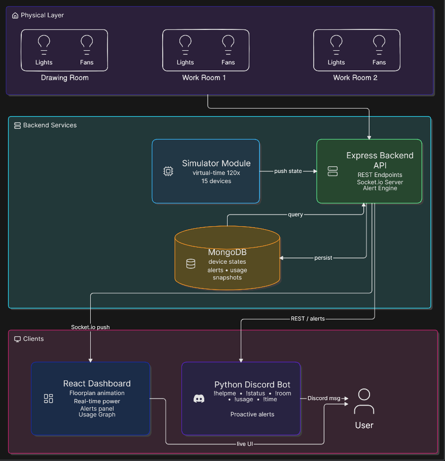

---

## 2. Directory Structure

```
├── backend/
│   ├── src/
│   │   ├── app.ts                 # Express configuration & routes mapping
│   │   ├── server.ts              # Database connection & socket server initialization
│   │   ├── config/                # Database configuration
│   │   ├── database/              # Seeding script
│   │   ├── middleware/            # Validator & error handler middlewares
│   │   ├── modules/               # Modular backend modules (alerts, devices, simulator, usage)
│   │   ├── scripts/               # verify-simulation integration test script
│   │   └── utils/                 # Socket, response, and catchAsync helpers
│   └── package.json
├── client/
│   ├── public/                # Office map SVGs & layouts
│   ├── src/
│   │   ├── assets/            # UI asset icons
│   │   ├── components/        # AlertsPanel, Header, OfficeDevices, UsageGraph components
│   │   ├── socket.ts          # Socket client configuration
│   │   ├── types.ts           # Shared TypeScript interfaces
│   │   ├── App.tsx            # Main layout and Socket.io hooks integration
│   │   └── index.css          # Tailwind configurations & theme resets
│   └── package.json
├── discordbot/
│   ├── bot.py                 # discord.py bot with Groq LLM integration
│   ├── requirements.txt       # Bot dependencies
│   └── env.sample             # Environment configuration template
├── wokwi/
│   ├── drawing.ino            # Drawing Room Firmware (C++ code)
│   ├── room1.ino              # Work Room 1 Firmware (C++ code)
│   ├── room2.ino              # Work Room 2 Firmware (C++ code)
│   ├── drawing_diagram.json   # Drawing Room Wokwi Canvas Schematic
│   ├── room1_diagram.json     # Work Room 1 Wokwi Canvas Schematic
│   ├── room2_diagram.json     # Work Room 2 Wokwi Canvas Schematic
│   └── README.md              # Hardware wiring and pinout guides
└── README.md                  # This documentation
```

---

## 3. Project Previews & Screenshots

### A. Web Dashboard

#### 1. Office Floorplan (Furnished Mode)

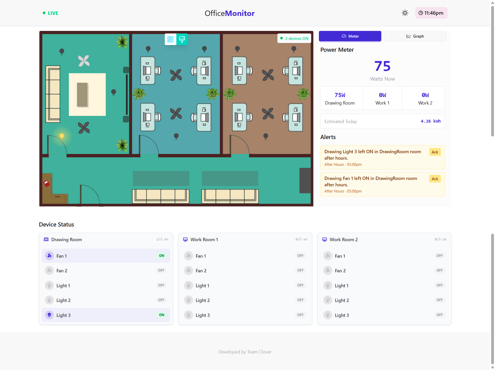

#### 2. Electrical Layout & Consumption Graphs (Circuit Mode)

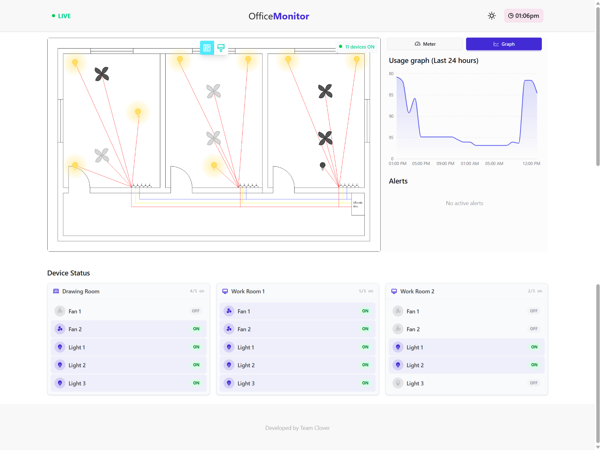

#### 3. Time Traveler Controls (Fast-Forwarding Clock)

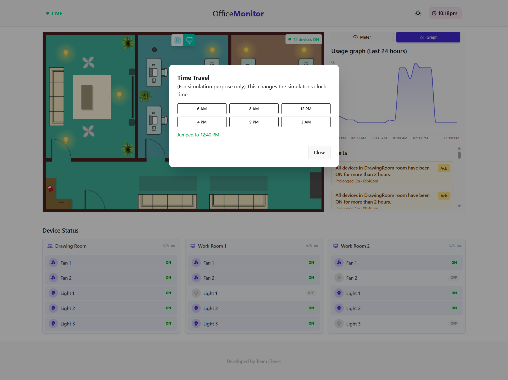

### B. Conversational Discord Bot

#### 1. Help Guide & Commands Overview (`!helpme`)

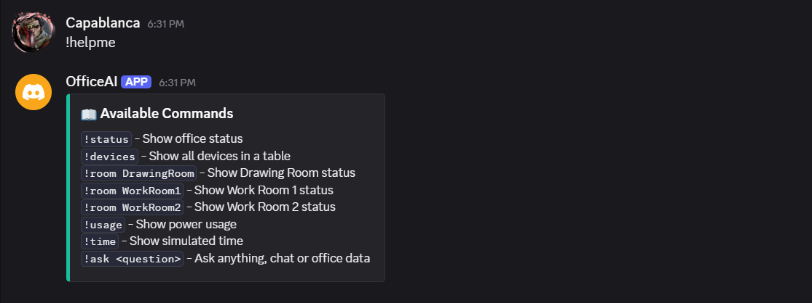

#### 2. Live Office Status Query (`!status`)

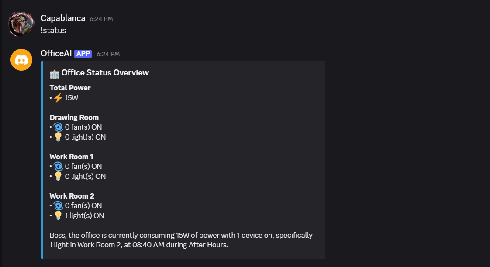

#### 3. Room Status Queries (`!room`)
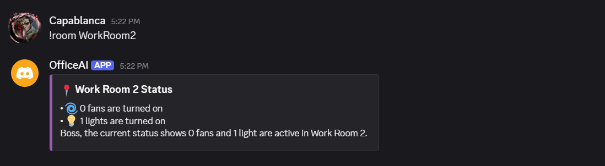

#### 4. Active Devices Query (`!devices`)
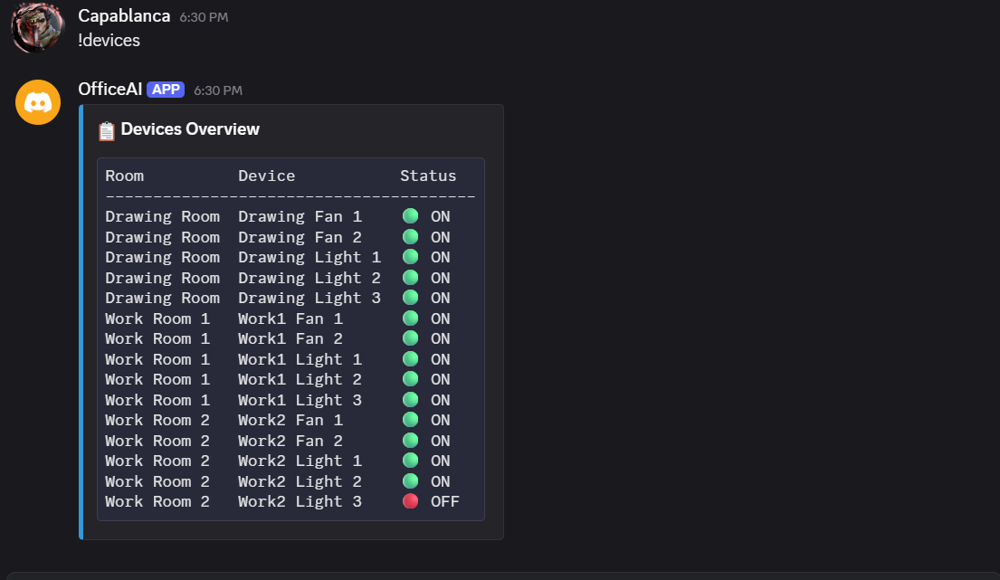

#### 5. Energy Consumption Stats (`!usage`)
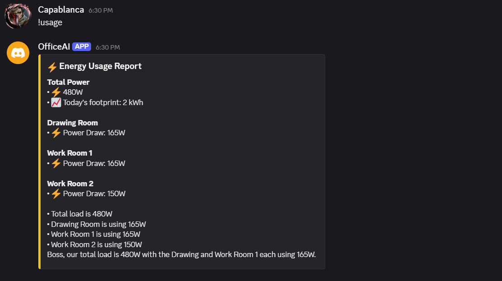

#### 6. Simulated Time Query (`!time`)
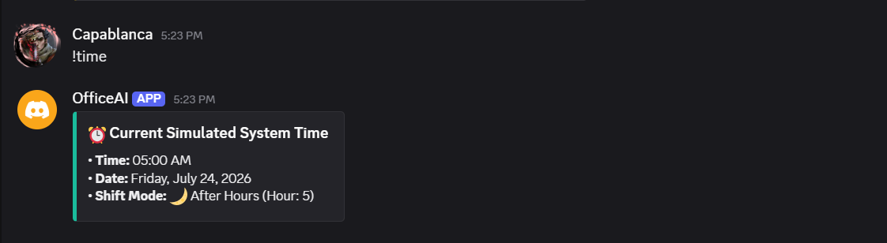

#### 7. Natural Language AI Query (`!ask`)
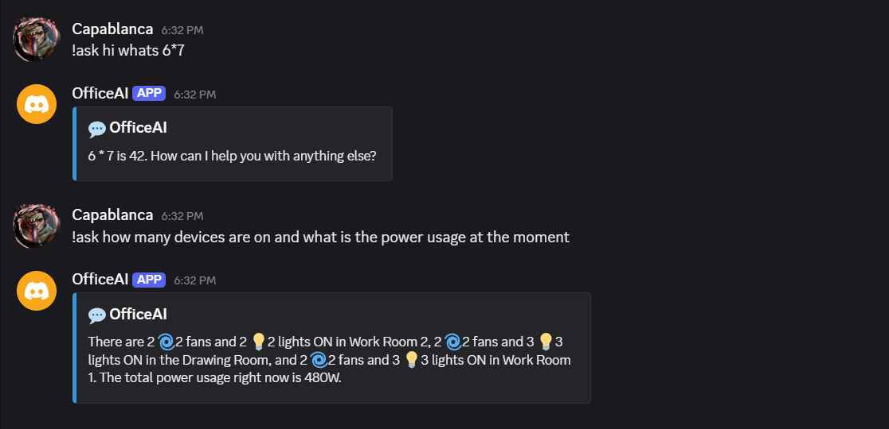

#### 8. Proactive Policy Violation Alerts
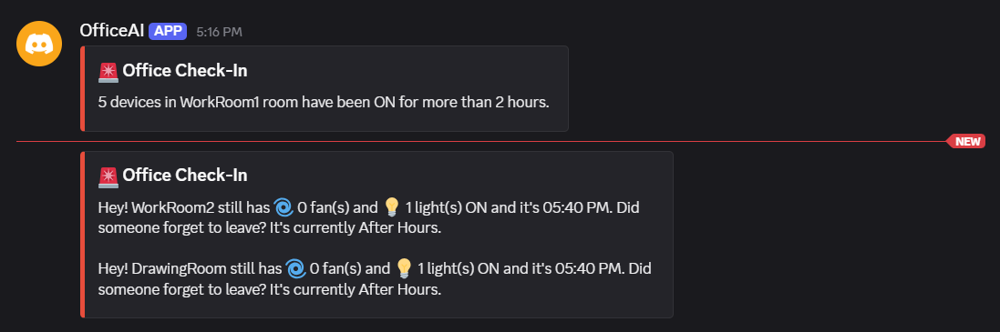

### C. Wokwi ESP32 Circuit Schematic

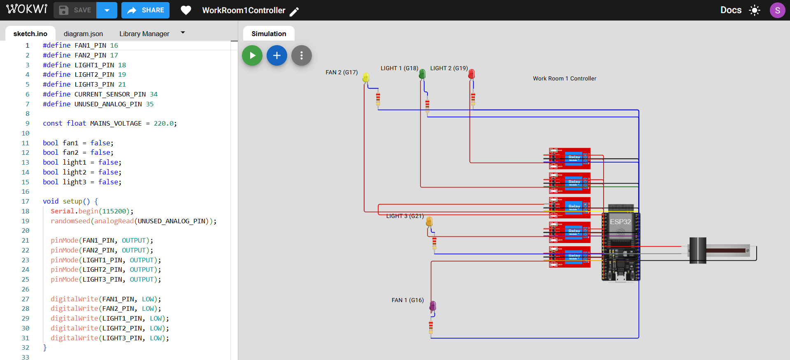

---

## 4. Component Details & Tech Stack

### A. Unified Express & TypeScript Backend

- **Database ODM:** Mongoose (MongoDB)
- **Virtual accelerated clock:** Accelerates time by `120x` (1 real second = 120 simulated seconds; 30 real seconds = 1 simulated hour). Starts at **8:00 AM** today.
- **24-Hour Catch-up Seeding:** On startup, the backend automatically performs a fast catch-up simulation of 72 ticks to populate a clean, realistic 24-hour database history. Socket and alert emissions are muted during catch-up.
- **Rules & Alert Engine:**
  - _After-Hours Rule:_ Any device left ON between 5:00 PM and 9:00 AM triggers an immediate timestamped alert.
  - _Prolonged-On Rule:_ A room where all devices have been ON for more than 2 simulated hours triggers a warning.
  - _Special Demo Override:_ All devices in Work Room 1 are automatically locked ON between 10:00 AM and 1:00 PM simulated time to guarantee that a prolonged-on alert triggers and resolves automatically during presentation walks.

### B. React Frontend Dashboard (Vite, TailwindCSS & Recharts)

- **Real-time Floorplan:** A responsive office floorplan showing live device states with glowing light indicators and spinning fan animations. Supports **Furnished View** and **Circuit View**.
- **WebSocket Engine:** Subscribes to the backend Socket.io updates to append new data points to the graph and toggle states in real-time without page refreshes.
- **Analytics:** Recharts bar charts showing hourly consumption averages for the last 24 simulated hours.

### C. Conversational Discord Bot (Python, Groq API & discord.py)

- **Conversational AI:** Integrates with the **Groq API** to process inputs and produce friendly, humanized natural language responses.
- **Available Discord Commands:**
  Once the bot is running and added to your server, type `!helpme` in any channel it can see, or use these directly:
  - `!status` — Show office status
  - `!devices` — Shows total devices and active status
  - `!room DrawingRoom` — Show Drawing Room status
  - `!room WorkRoom1` — Show Work Room 1 status
  - `!room WorkRoom2` — Show Work Room 2 status
  - `!usage` — Show power usage
  - `!time` — Show simulated time
  - `!ask <question>` — Chat with AI as usual and also replies to any query related to the backend.
- **Proactive Alerts Broadcast:** Runs a background task polling the `/api/alerts` endpoint, posting warning alerts to designated Discord channels the moment a rule violation is detected in the office.

### D. Wokwi ESP32 Hardware Simulations

- **Simulated Sensors:** Utilizes a sliding potentiometer to simulate an **ACS712 current sensor** connected to GPIO 34 (VP), baseline voltage of 1.65V (offset).
- **JSON Serial Outputs:** Outputting JSON snapshots of room device states and simulated power draws to the Serial Monitor every 5 seconds.
- **Standard Wiring Colors:** Red/Black (supply power), Brown (simulated AC live line), Blue (simulated Neutral return), Gray (analog inputs).

---

## 5. Getting Started & Setup Guide

### Backend Server Setup

1.  Navigate to the `backend/` directory:
    ```bash
    cd backend
    ```
2.  Install dependencies:
    ```bash
    npm install
    ```
3.  Configure variables in a `.env` file based on `backend/.env.example`:
    ```env
    PORT=5000
    MONGO_URI=mongodb://localhost:27017/boss-monitor
    SIMULATOR_CLOCK_SPEED=120
    SIMULATOR_TICK_RATE_MS=10000
    NODE_ENV=development
    ```
4.  Start development server:
    ```bash
    npm run dev
    ```

### Frontend Dashboard Setup

1.  Navigate to the `client/` directory:
    ```bash
    cd client
    ```
2.  Install dependencies:
    ```bash
    npm install
    ```
3.  Configure variables in a `client/.env` file based on `client/env` template:
    ```env
    VITE_API_URL="http://localhost:5000"
    ```
4.  Start development server:
    ```bash
    npm run dev
    ```

### Discord Bot Setup

1.  Navigate to the `discordbot/` directory:
    ```bash
    cd discordbot
    ```
2.  Install dependencies using pip:
    ```bash
    pip install -r requirements.txt
    ```
3.  Configure variables in a `.env` file based on `discordbot/env.sample`:
    ```env
    DISCORD_TOKEN="YOUR_DISCORD_BOT_TOKEN"
    GROQ_API_KEY="YOUR_GROQ_API_KEY"
    BACKEND_URL="http://localhost:5000"
    ALERT_CHANNEL_ID="YOUR_DISCORD_ALERT_CHANNEL_ID_1"
    ALERT_CHANNEL_ID_2="YOUR_DISCORD_ALERT_CHANNEL_ID_2"
    ```
4.  Run the bot:
    ```bash
    python bot.py
    ```

---

## 6. API Reference

- **Production Live API Base URL:** [https://boss-monitor.onrender.com](https://boss-monitor.onrender.com)
- **API Response Examples:** Refer to [backend/api_responses.md](backend/api_responses.md) for real payload examples.
- **Local Development Base URL:** `http://localhost:5000`

### Endpoints

- **`GET /`** — Health details, client IP metadata, and system uptime.
- **`GET /api/devices`** — Fetches all 15 devices.
- **`GET /api/devices/rooms/:room`** — Fetches devices for a room (`DrawingRoom`, `WorkRoom1`, `WorkRoom2`).
- **`GET /api/usage`** — Live room-wise wattage breakdown, cumulative kWh, BDT costs, and simulated clock.
- **`GET /api/usage/history`** — Fetches the last 50 snapshots.
- **`GET /api/usage/hourly`** — Hourly consumption bar charts statistics for the past 24 hours.
- **`GET /api/alerts`** — Active and historical alerts.
- **`POST /api/alerts/:id/ack`** — Acknowledges an alert to prevent Discord broadcast notification spam.
- **`POST /api/simulator/device`** — Manually overrides a device status (`on` or `off`).
- **`POST /api/simulator/time`** — Jumps the simulated virtual clock to a specific hour (0-23).

---

## 7. Wokwi Hardware Simulations

For details on wiring standards, pinout configurations, and the C++ firmware, refer to the [Wokwi Hardware Simulation Guide](wokwi/README.md).

### Live Wokwi Simulation Projects

| Room             | Wokwi Project Simulation URL                                             |
| :--------------- | :----------------------------------------------------------------------- |
| **Drawing Room** | [Drawing Room Simulation](https://wokwi.com/projects/468547829392730113) |
| **Work Room 1**  | [Work Room 1 Simulation](https://wokwi.com/projects/468601813237379073)  |
| **Work Room 2**  | [Work Room 2 Simulation](https://wokwi.com/projects/468602256710643713)  |
